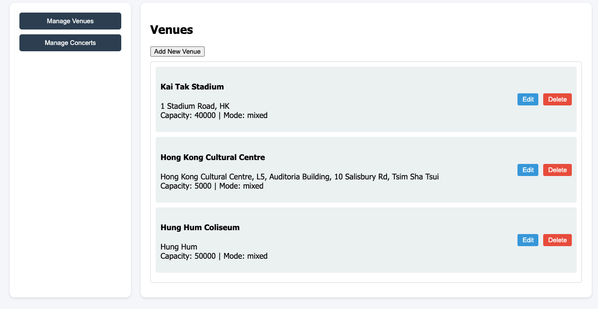
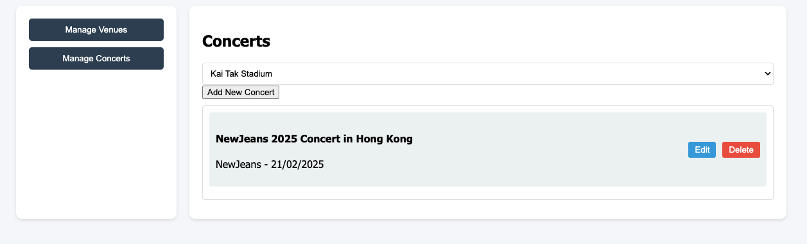

# CRUD Operations Page

This page is a simple CRUD operations page that allows you to create, read, update, and delete items from a list. Note that the list is retrieved from Wagtail CMS, and the CRUD operations are performed with HTTP requests with a JSON payload.

The reason that a separate page is created is due to the following:

- Reduce the overhead of learning Google Sheets API
- Allow local demo of the CRUD operations instead of deploying the database into the cloud

Below are some of the key files in the project:

## Interface

## `index.html`

This is the main page of the CRUD operations page. It contains a form to add a new item to the list, and a table to display the list of items. Each item in the list has an edit and delete button.
A hidden form for editing / adding an item is also included in the page. It will automatically display at the top when the edit button / add button is clicked.

## `styles.css`

This is the CSS file for the CRUD operations page. It contains the styles for the form, table, and buttons.

## `script.js`

This is the JavaScript file for the CRUD operations page. It contains the functions to add, edit, and delete items from the list. It also contains the functions to display the edit form when the edit button is clicked. Every button click has an EventListener that calls the appropriate function, and for different buttons, they are mostly used to send HTTP requests to the CMS server, and a RESTful response will be sent back (although in this CRUD page, those response are not really used if we are talking the context of HATEOAS).

